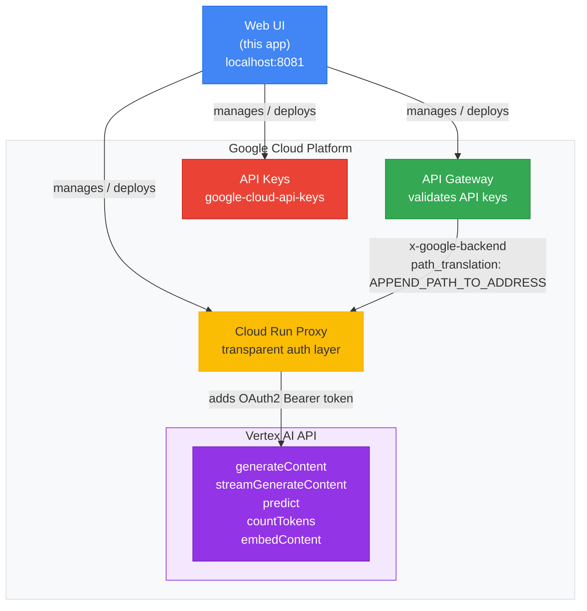
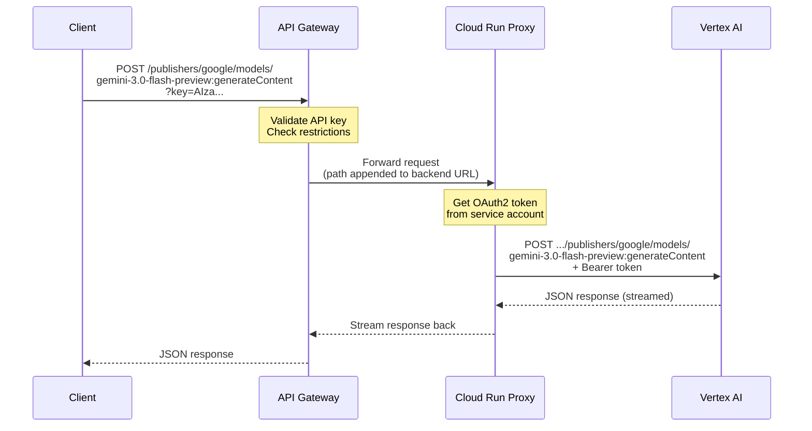

# API Gateway Manager

Web application for managing the full lifecycle of a Google Cloud API Gateway
that secures access to Vertex AI services through API key validation.

## Architecture



### Request Flow



### Key Design Decisions

- **Transparent proxy**: The Cloud Run service forwards any path to
  `{region}-aiplatform.googleapis.com/v1/projects/{project}/locations/{region}/{path}`.
  It only adds the OAuth2 bearer token. New Vertex AI methods work automatically
  without proxy changes.
- **API Gateway validates keys**: Uses OpenAPI 2.0 spec with `securityDefinitions`
  for API key auth and `x-google-backend` with `path_translation: APPEND_PATH_TO_ADDRESS`.
- **Model-agnostic**: The proxy forwards any model path -- Gemini, Imagen, embeddings,
  custom endpoints. No proxy changes needed for new models.
- **gcloud CLI via async subprocess**: Gateway and Cloud Run operations use
  `asyncio.create_subprocess_exec` for reliable deployment management.
- **google-cloud-api-keys client library**: API key CRUD uses the Python client
  directly (sync).

## Vertex AI Methods Exposed

Derived from the [Vertex AI Discovery Document](https://aiplatform.googleapis.com/$discovery/rest?version=v1):

| Gateway Path | Vertex AI Method | Auth |
|---|---|---|
| `/publishers/google/models/{model}:generateContent` | Generate content (Gemini) | API key |
| `/publishers/google/models/{model}:streamGenerateContent` | Streaming generation | API key |
| `/publishers/google/models/{model}:countTokens` | Count tokens | API key |
| `/publishers/google/models/{model}:embedContent` | Generate embeddings | API key |
| `/endpoints/{endpoint}:predict` | Online prediction (custom model) | API key |
| `/endpoints/{endpoint}:generateContent` | Generate content (tuned endpoint) | API key |
| `/endpoints/{endpoint}:rawPredict` | Raw prediction | API key |
| `/health` | Proxy health check | None |

## Prerequisites

- Python 3.11+
- [Google Cloud SDK](https://cloud.google.com/sdk/docs/install) (`gcloud` CLI)
- A GCP project with billing enabled
- Authenticated: `gcloud auth login && gcloud auth application-default login`

## Quick Start

```bash
# 1. Clone and enter the project
cd api-management-service

# 2. Run setup (checks prereqs, generates .env, installs deps)
./scripts/setup.sh

# 3. Enable required GCP APIs
./scripts/enable-gcp-apis.sh <PROJECT_ID>

# 4. Create service accounts with proper IAM roles
./scripts/create-service-account.sh <PROJECT_ID>

# 5. Review and edit .env
cat .env

# 6. Start the app
python run.py
```

Open [http://localhost:8081](http://localhost:8081)

## Setup Scripts

| Script | What it does |
|---|---|
| `scripts/setup.sh` | Check prereqs, detect GCP config, generate `.env`, install Python deps |
| `scripts/enable-gcp-apis.sh` | Enable aiplatform, apigateway, run, apikeys, and supporting APIs |
| `scripts/create-service-account.sh` | Create `api-gateway-sa` (Cloud Run invoker) and `vertex-proxy-sa` (Vertex AI user) |

## Configuration

All settings are in `.env` (see `.env.example`):

```
GCP_PROJECT_ID=mestrealvaro         # GCP project
GCP_REGION=us-central1              # Default region
GATEWAY_API_ID=                     # Set after creating API via UI
PROXY_SERVICE_NAME=vertex-ai-proxy  # Cloud Run service name
PROXY_SERVICE_ACCOUNT=              # SA with roles/aiplatform.user
VERTEX_AI_REGION=us-central1        # Vertex AI region
VERTEX_AI_MODEL=gemini-3.0-flash-preview    # Default Gemini model
```

## Project Structure

```
api-management-service/
+-- app/
|   +-- config.py                # Settings from .env
|   +-- main.py                  # FastAPI app, lifespan, exception handlers
|   +-- routers/
|   |   +-- dashboard.py         # GET /api/dashboard
|   |   +-- gateway.py           # /api/gateway/* (APIs, configs, gateways)
|   |   +-- proxy.py             # /api/proxy/* (status, preview, deploy)
|   |   +-- api_keys.py          # /api/keys/* (list, create, delete)
|   +-- schemas/
|   |   +-- dashboard.py         # OverallDashboardResponse
|   |   +-- gateway.py           # Gateway API/Config/Gateway models
|   |   +-- proxy.py             # ProxyDeployRequest, ProxyStatusResponse
|   |   +-- api_keys.py          # KeyCreateRequest, KeyResponse
|   +-- services/
|   |   +-- gcloud_runner.py     # Async subprocess wrapper for gcloud CLI
|   |   +-- gateway_service.py   # API Gateway CRUD + OpenAPI spec generation
|   |   +-- proxy_service.py     # Proxy code generation + Cloud Run deploy
|   |   +-- api_keys_service.py  # API key management via client library
|   +-- static/
|       +-- index.html           # Single-page UI
|       +-- css/app.css
|       +-- js/
|           +-- api.js           # ApiClient (gateway, proxy, keys)
|           +-- components.js    # UI rendering functions
|           +-- app.js           # Event handlers and data loading
+-- scripts/
|   +-- setup.sh
|   +-- enable-gcp-apis.sh
|   +-- create-service-account.sh
+-- tests/                       # 84 tests
|   +-- conftest.py
|   +-- test_gcloud_runner.py
|   +-- test_gateway_service.py
|   +-- test_proxy_service.py
|   +-- test_api_keys_service.py
|   +-- test_gateway_routes.py
|   +-- test_proxy_routes.py
|   +-- test_api_keys_routes.py
|   +-- test_dashboard_routes.py
+-- requirements.txt
+-- pyproject.toml
+-- run.py
+-- .env.example
```

## API Endpoints

### Dashboard
- `GET /api/dashboard` -- Aggregated status of gateway, proxy, and keys

### Gateway (`/api/gateway`)
- `POST /apis?api_id=...` -- Create API
- `GET /apis` -- List APIs
- `GET /apis/{api_id}` -- Get API details
- `DELETE /apis/{api_id}` -- Delete API
- `POST /apis/{api_id}/configs` -- Create API config (generates OpenAPI spec)
- `GET /apis/{api_id}/configs` -- List configs
- `DELETE /apis/{api_id}/configs/{config_id}` -- Delete config
- `POST /gateways` -- Deploy gateway
- `GET /gateways/{gateway_id}` -- Get gateway status
- `PATCH /gateways/{gateway_id}` -- Update gateway config
- `DELETE /gateways/{gateway_id}` -- Delete gateway
- `GET /dashboard` -- Gateway-specific dashboard

### Proxy (`/api/proxy`)
- `GET /status` -- Cloud Run service status
- `POST /preview` -- Preview generated proxy code
- `POST /deploy` -- Deploy transparent proxy to Cloud Run
- `DELETE /` -- Delete proxy service

### API Keys (`/api/keys`)
- `GET /` -- List keys
- `POST /` -- Create key (optionally restricted to gateway)
- `GET /{key_id}/key-string` -- Reveal key string
- `DELETE /{key_id}` -- Delete key

## Running Tests

```bash
python -m pytest tests/ -v
```

## Example: Calling Gemini through the Gateway

After deploying the gateway and creating an API key:

```bash
# Generate content with Gemini
curl -X POST "https://YOUR-GATEWAY.uc.gateway.dev/publishers/google/models/gemini-3.0-flash-preview:generateContent?key=YOUR_API_KEY" \
  -H "Content-Type: application/json" \
  -d '{
    "contents": [{
      "role": "user",
      "parts": [{"text": "Explain API Gateway in one sentence."}]
    }]
  }'

# Count tokens
curl -X POST "https://YOUR-GATEWAY.uc.gateway.dev/publishers/google/models/gemini-3.0-flash-preview:countTokens?key=YOUR_API_KEY" \
  -H "Content-Type: application/json" \
  -d '{
    "contents": [{
      "role": "user",
      "parts": [{"text": "Hello world"}]
    }]
  }'

# Custom endpoint prediction
curl -X POST "https://YOUR-GATEWAY.uc.gateway.dev/endpoints/1234567890:predict?key=YOUR_API_KEY" \
  -H "Content-Type: application/json" \
  -d '{
    "instances": [{"input": "data"}]
  }'
```

## GCP APIs Required

Enabled by `scripts/enable-gcp-apis.sh`:

- `aiplatform.googleapis.com` -- Vertex AI
- `apigateway.googleapis.com` -- API Gateway
- `servicemanagement.googleapis.com` -- Required by API Gateway
- `servicecontrol.googleapis.com` -- Required by API Gateway
- `run.googleapis.com` -- Cloud Run
- `artifactregistry.googleapis.com` -- Container images
- `cloudbuild.googleapis.com` -- Source deploys
- `apikeys.googleapis.com` -- API key management
- `iam.googleapis.com` -- Service account creation

## IAM Roles

Created by `scripts/create-service-account.sh`:

| Service Account | Role | Purpose |
|---|---|---|
| `api-gateway-sa` | `roles/run.invoker` | API Gateway backend auth to invoke Cloud Run |
| `vertex-proxy-sa` | `roles/aiplatform.user` | Cloud Run proxy to call Vertex AI APIs |
